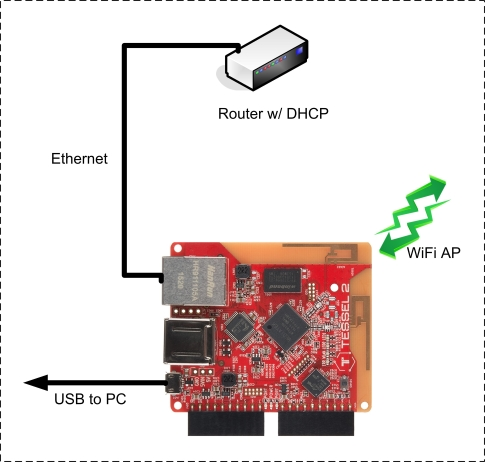

# Tessel 2 Networking

This repository contains a networking application for the Tessel 2.

# Purpose

The *basic* intended purposes are - 

* Enable an access point and allow stations to connect, and then provide them with an IP address 
* Use the Ethernet interface to obtain an IP address via DHCP
* Characterize the behavior of the AP when enabling or disabling programmatically
* Investigate the Tessel's network API and its usage 
* Test modifications to the Tessel's access point API. Current modifications are -
  * Get/Change WIFi channel
  * Get a list of connected stations

At this time routing traffic between the Wifi interface and the Ethernet interface is not required. This will be addressed in a separate application and accompanying documentation.

## *Some* Potential Uses

* IoT gateway
* Low power, portable access point
* WiFi Honeypot
* *TBD*

# Tessel 2 Development Environment

Hosted on Windows 10 64bit with Node.js 6.10.2.

## Tessel 2 Environment Versions

* t2-cli: 0.1.8
* t2-firmware: 0.1.0
  * OpenWRT: ? 
* Node.js: 6.10.3

## Tessel 2 Network Connections

The Ethernet port is connected to a LAN/router and will obtain an IP address via DHCP. The wireless interface will act as an access point and as a DHCP server to connected stations.

<p align="center">
  
</p>

# Running the Application

In order to use the application it is necessary to update the Tessel 2 firmware. There is a single JavaScript file that contains entire Tessel 2 API.  

## Initial Steps

Go to the [Tessel 2 Documentation](https://tessel.github.io/t2-start/) and follow the steps up through "Blinky".

The procedure below uses the `scp` command which is not available in any Windows version. So if you are running on Windows you will need to do one of the following - 

* Use the Git Bash shell. If you've installed Git on your Windows machine there's a chance you will have it. Typically it installs a Windows Explorer context menu item. If you right-click on a folder you should see "Git Bash Here" in the menu. If you do, you're all set.
* Install a Windows `scp` program. 
* _TBD_

## Update the Tessel 2 Firmware

1) **_Clone_** this repository, please do not fork unless you're contributing.
2) Open a command line window using your chosen shell in your copy of this repository.
3) Navigate to the `tessel_mods/t2-firmware/node` folder.
4) Type in the following command - 

`# scp -i ~/.tessel/id_rsa ./tessel-export.js root@YOUR_TESSEL:/usr/lib/node`

Where : `YOUR_TESSEL` identifies the Tessel that you're using. It can be the Tessel's IP address, or in _some_ cases it can be the name you gave it when following the official Tessel documentation.

5) Run the command, the copy should be successful.

## Download and Run

After successfully copying the updated `tessel-export.js` file to your Tessel just run this application like any other - 

`# t2 run tessel-ap-test.js`

## Application Output

```
INFO Looking for your Tessel...
INFO Connected to Tessel-02A30CB079FF.
INFO Building project.
INFO Writing project to RAM on Tessel-02A30CB079FF (72.192 kB)...
INFO Deployed.
INFO Running tessel-ap-test.js...
I'm blinking! (Press CTRL + C to quit and shutdown the AP)


wifi disconnect
SUCCESS - wifi.disable
setting AP channel 2 now...

wifi new channel = 2
AP channel = 2
creating AP now...

SUCCESS - AP created :
{
    "ssid": "TESSEL_TEST",
    "password": "12341234$",
    "security": "psk2",
    "channel": 2,
    "ip": "192.168.1.101"
}
enabling AP now...

AP enable event

getNetIF() looking for wlan0 - #0
```

### Waiting for wlan0

```
getNetIF() looking for wlan0 - #1
getNetIF() looking for wlan0 - #2
getNetIF() looking for wlan0 - #3
```

### Collect wlan0 and eth0 Information

```
getIPv4(wlan0) -
{
    "address": "192.168.1.101",
    "netmask": "255.255.255.0",
    "family": "IPv4",
    "mac": "01:a3:0c:bb:dd:ff",
    "internal": false
}
getIPv4(eth0) -
{
    "address": "192.168.0.26",
    "netmask": "255.255.255.0",
    "family": "IPv4",
    "mac": "01:a3:0c:bb:dd:ff",
    "internal": false
}
```

### Start the HTTP Servers and Scan for Stations

```
httpsrv : starting up http server on 192.168.1.101:80 /tmp/remote-script/public/www
httpsrv : starting up http server on 192.168.0.26:80 /tmp/remote-script/public/wwwadmin

station scan started...

httpsrv : server is listening on 192.168.1.101:80
httpsrv : server is listening on 192.168.0.26:80

event stations = []
```

### Terminate the Application

```
^C
Caught interrupt signal

AP disable event
```

### Connected Stations

```json
event stations = [{"mac":"42:77:e8:49:59:a3","ip":"192.168.1.189","host":"SOME_HOSTNAME","tstamp":1527411135,"iface":"wlan0"}]
```

<hr>

## HTTP Servers

There are two http servers in the application. One will be considered as an *administration* portal and the other is for access point clients. 

### Folder Hierarchy

```
\ ------+
        |
        +- public --+-- 404.html
                    |
                    +-- assets ---+
                    |             |
                    |             + css -- 404.css
                    |
                    +-- www ------+-- index.html, favicon.ico
                    |             |
                    |             +-- assets -+
                    |                         + img -- tessel.png 
                    |
                    +-- wwwadmin -+-- index.html, favicon.ico
                                  |
                                  +-- assets -+
                                              + css -- index.css 
                                              |
                                              + img -- tessel.png 
```

### Admin API

The following paths are available - 

* `GET /info/ip` - return the web client's IP address
* `GET /info/stations` - return the list currently connected AP stations


<hr>


### Access Point Characteristics

* WiFi Channel : This defaults to channel 11.
* AP IP Address : This defaults to 192.168.1.101

In the current Tessel 2 version those properties are only modifiable from within OpenWRT. Please refer to the OpenWRT documentation at [The UCI System](https://openwrt.org/docs/guide-user/base-system/uci) and [WiFi /etc/config/wireless](https://openwrt.org/docs/guide-user/network/wifi/basic) for details. 

#### Modifying the Access Point Characteristics

This will be addressed later in this document under [OpenWRT Configuration](#openwrt-configuration).

# Desired Results

For this application it is expected that :

* The access point will initialize and allow WiFi stations to connect and obtain an IP address with DHCP.
* The duration of time in which the access point initializes and becomes ready for station connections should be a reasonably brief period of time.
* The Ethernet client will obtain an IP address from a DHCP sever on the same network.

## Actual Access Point Behavior

## Actual LAN Client Behavior

It behaves as expected. There are no visible delays in regards to startup and DHCP.

<hr>

# Test Application Details

## Application Initialize and Start Up

The `t2 init` command creates an `index.js` file with the following - 

```javascript
'use strict';

// Import the interface to Tessel hardware
const tessel = require('tessel');

// Turn one of the LEDs on to start.
tessel.led[2].on();

// Blink!
setInterval(() => {
  tessel.led[2].toggle();
  tessel.led[3].toggle();
}, 100);
```

A variation of that code is used in this application for the purpose of indicating that it is running. Additions to it include - 

* Turning off the GPIO ports, which has the side effect of turning off the PORT A and PORT B LEDs.
* Increasing the blink interval to 500ms.
* Saving the timer id for a subsequent call to `clearInterval()`.

In addition, `index.js` has been renamed to `tessel-ap-test.js`.

The remainder of the code in `tessel-ap-test.js` consistutes the testing code for this application. Here is an overview of its operation :

<p align="center">
  
</p>

## Access Point Initialization

As previously mentioned in this document a programmatic method for initializing the Tessel access point is used. Here is an overview of how it's been accomplished :  

<p align="center">
  
</p>

## Display Network Interface Information

After the access point has been created and enabled a periodic call to `os.networkInterfaces()` is made and its returned data is checked for the presence of an array labeled as `"wlan0"`. When it is present and containing two elements it's evidence that the access point is running and available.

<p align="center">
  
</p>

## Shutdown and Disable


<p align="center">
  
</p>

<hr>

# OpenWRT Configuration

In order to modify the 

[The UCI System](https://openwrt.org/docs/guide-user/base-system/uci)


# Tessel 2 Network API Modifications


The following has been added - 

* Get/Set the WiFi channel
* Request a list of stations connected to the access point


* **Access Point** :
    * Provide the ability to programmatically configure -
        * AP IP address
        * AP Channel number <- complete
        * DHCP lease duration
        * Maximum *allowed* quantity of connected stations
    * New events - 
        * `tessel.network.ap.on('stationconnect', function(station) {/* manage station connections */});`
            * the  `station` argument is an object containing station information. (*See below*)
        * `tessel.network.ap.on('stationdisconnect', function(station) {/* manage station disconnections */});`
            * the  `station` argument is an object containing station information. (*See below*)
    * New method(s) - 
        * `var apstatus = tessel.network.ap.status();`
            * `apstatus` is an object. (*See below*)

**`stationconnect`** object :

The `station` object will contain - 

On successful connection to the AP (*With appropriate differences for `IPv6`*) :
```json
{
    "connected":true,
    "address": "192.168.1.X",
    "netmask": "255.255.255.0",
    "family": "IPv4",
    "mac": "00:11:22:33:44:55"
}
```

**`stationdisconnect`** object :

On successful disconnection from the AP (*With appropriate differences for `IPv6`*) :
```json
{
    "connected":false,
    "address": "192.168.1.X",
    "mac": "00:11:22:33:44:55"
}
```

**`apstatus`** object :

The AP status could be reported as - 
```json
{
    "enabled":[false or true],
    "connections": [0 to n],
}
```

* **Station** : 
   * Clear/remove all station configuration settings, such as SSID, password, and encryption.
   * *TBD*

<hr>

# Tessel 2 Firmware Modifications

Below are modifications I've made in regards to the proposals mentioned above. 

## Access Point API Modifications

Each *new* setting will be tested using the `UCI` via SSH and the command-line.

**WiFi Channel** : `uci set wireless.@wifi-device[0].channel=6` - Set the WiFi channel to `6`.<br>
**Static AP IP Address** : `uci set network.lan.ipaddr=192.168.1.101` - Set the IP address used by the AP.<br>
**IP Net Mask** : `uci set network.lan.netmask=255.255.255.0` - <br>

**DHCP Start** : `uci set dhcp.lan.start=100` - <br>
**DHCP Limit** : `uci set dhcp.lan.limit=150` - <br>
**DHCP Lease Time** : `uci set dhcp.lan.leasetime=12h` - <br>
See [OpenWRT - DHCP Pools](https://openwrt.org/docs/guide-user/base-system/dhcp_configuration#dhcp_pools) for additional information..

**Connected Stations** : `iw dev wlan0 station dump` - will produce :<br>
```
Station 5c:a8:6a:f4:e8:ee (on wlan0)
        inactive time:  2730 ms
        rx bytes:       33012
        rx packets:     736
        tx bytes:       11621
        tx packets:     67
        tx retries:     6
        tx failed:      29
        signal:         -37 dBm
        signal avg:     -37 dBm
        tx bitrate:     26.0 MBit/s MCS 3
        rx bitrate:     12.0 MBit/s
        expected throughput:    9.612Mbps
        authorized:     yes
        authenticated:  yes
        preamble:       short
        WMM/WME:        yes
        MFP:            no
        TDLS peer:      no
        connected time: 111 seconds
```

And `iwinfo wlan0 assoclist` will produce :<br>

```
5C:A8:6A:F4:E8:EE  -37 dBm / unknown (SNR -37)  70 ms ago
        RX: 12.0 MBit/s, MCS 0, 20MHz                   1189 Pkts.
        TX: 28.9 MBit/s, MCS 3, 20MHz, short GI          107 Pkts.
```
If there are no stations connected - 
```
No station connected
```

For a more manageable list use `arp`, which will produce :<br>

```
IP address       HW type     Flags       HW address            Mask     Device
192.168.1.158    0x1         0x2         23:00:6a:f4:e8:ab     *        wlan0
192.168.0.7      0x1         0x2         10:0a:23:e1:ab:3c     *        eth0
192.168.0.1      0x1         0x2         10:aa:21:d5:0d:99     *        eth0
```

Then refine it a little with this - `arp | grep wlan0`, which will produce :<br>

```
192.168.1.158    0x1         0x2         23:00:6a:f4:e8:ab     *        wlan0
```

And `cat /tmp/dhcp.leases` will give you - <br>

```
1525596466 5c:a8:6a:f4:e8:ee 192.168.1.158 android-72d96d29a805b447 01:5c:a8:6a:f4:e8:ee
```


# Scratch Pad Section

this section is just a container for stuff I may or may not retain for this document. **consider it to be temporary and very likely to change or be removed.**

* Resources used : 
    * [OpenWRT Wireless configuration / Wifi Networks](https://wiki.openwrt.org/doc/uci/wireless#wifi_networks)
* Affected File(s) :
    * ` /etc/config/wireless` - via `uci`
    * `node/tessel-export.js`

```uci
config wifi-device 'radio0'
        option type 'mac80211'
        option channel '11'
        option hwmode '11g'
        option path '10180000.wmac'
        option htmode 'HT20'
        option disabled '0'

config wifi-iface
        option device 'radio0'
        option network 'wifi'
        option mode 'sta'
        option key 'password'
        option ssid 'SOME_SSID'
        option encryption 'psk2'
        option disabled '1'

config wifi-iface
        option device 'radio0'
        option network 'lan'
        option mode 'ap'
        option encryption 'psk2'
        option key '12341234$'
        option ssid 'TESSEL_TEST'
        option disabled '1'
```

Then in `node/tessel-export.js:createNetwork(settings)` change ` const commands` to be :

```javascript
  const commands = `
    uci batch <<EOF
    set wireless.@wifi-iface[1].ssid="${settings.ssid}"
    set wireless.@wifi-iface[1].key="${settings.password}"
    set wireless.@wifi-iface[1].encryption="${settings.security}"
    EOF
  `;
```

### Settings


