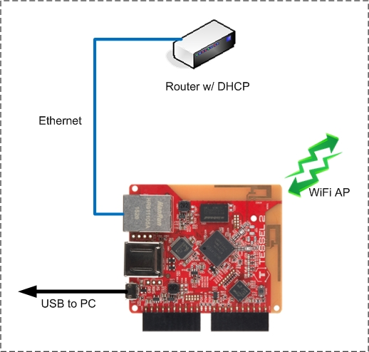

# Tessel 2 Networking

This repository contains a networking application for the Tessel 2.

- [Goals](#goals)
  * [Potential Uses](#potential-uses)
- [Tessel 2 Development Environment](#tessel-2-development-environment)
  * [Tessel 2 Environment Versions](#tessel-2-environment-versions)
  * [Tessel 2 Network Connections](#tessel-2-network-connections)
- [Running the Application](#running-the-application)
  * [Initial Steps](#initial-steps)
  * [Update the Tessel 2 Firmware](#update-the-tessel-2-firmware)
  * [Download and Run](#download-and-run)
  * [Application Output](#application-output)
    + [Waiting for wlan0](#waiting-for-wlan0)
    + [Collect wlan0 and eth0 Information](#collect-wlan0-and-eth0-information)
    + [Start the HTTP Servers and Scan for Stations](#start-the-http-servers-and-scan-for-stations)
    + [Connected Stations](#connected-stations)
    + [Terminating the Application](#terminating-the-application)
- [Run Time Options](#run-time-options)
  * [Random SSID and WiFi Channel](#random-ssid-and-wifi-channel)
  * [Application Event Handling](#application-event-handling)
    + [Tessel WiFi Events](#tessel-wifi-events)
    + [Station Events](#station-events)
  * [Muting Console Output](#muting-console-output)
  * [HTTP Servers](#http-servers)
    + [Enabling the HTTP Servers](#enabling-the-http-servers)
    + [Folder Hierarchy](#folder-hierarchy)
    + [Application API](#application-api)

<small><i><a href='http://ecotrust-canada.github.io/markdown-toc/'>Table of contents generated with markdown-toc</a></i></small>

**Related Documents:**
* [Application Design Details](https://github.com/jxmot/tessel-networking-example/blob/master/appdesign.md)
* [Tessel 2 Firmware Modifications](https://github.com/jxmot/tessel-networking-example/blob/master/t2mods.md)
* [Web Server Design Details](https://github.com/jxmot/tessel-networking-example/blob/master/aphttp.md)

# Goals

The intended goals are - 

* Create an application that can be used as a template for future projects
* Enable an access point and allow stations to connect, and then provide them with an IP address 
* Disable the Tessel's WiFi station
* Use the Ethernet interface to obtain an IP address via DHCP
* Characterize the behavior of the AP when enabling or disabling programmatically
* Investigate the Tessel's network API and its usage 
* Test modifications to the Tessel's access point API. Current modifications are -
  * Get/Change WIFi channel
  * Get a list of connected stations

At this time routing traffic between the Wifi interface and the Ethernet interface is not required. This will be addressed in a separate application and accompanying documentation.

## Potential Uses

* IoT gateway
* Low power, portable access point
* WiFi Honeypot
* *TBD*

# Tessel 2 Development Environment

Hosted on Windows 10 64bit with Node.js 6.10.2.

## Tessel 2 Environment Versions

* t2-cli: 0.1.8
* t2-firmware: 0.1.0
  * OpenWRT: ? 
* Node.js: 6.10.3

## Tessel 2 Network Connections

The Ethernet port is connected to a LAN/router and will obtain an IP address via DHCP. The wireless interface will act as an access point and as a DHCP server to connected stations.

<p align="center">
  
</p>

# Running the Application

In order to use the application it is necessary to modify the Tessel 2 firmware. There is a single JavaScript file that contains entire Tessel 2 API. 

## Initial Steps

Go to the [Tessel 2 Documentation](https://tessel.github.io/t2-start/) and follow the steps up through "Blinky".

The procedure below uses the `scp` command which is not available in any Windows version. So if you are running on Windows you will need to do one of the following - 

* Use the Git Bash shell. If you've installed Git on your Windows machine there's a chance you will have it. Typically it installs a Windows Explorer context menu item. If you right-click on a folder you should see "Git Bash Here" in the menu. If you do, you're all set.
* Install a Windows `scp` program. 
* _TBD_

## Update the Tessel 2 Firmware

1) **_Clone_** this repository, please do not fork unless you're contributing.
2) Open a command line window using your chosen shell in your copy of this repository.
3) Navigate to the `tessel_mods/t2-firmware/node` folder.
4) Type in the following command - 

`# scp -i ~/.tessel/id_rsa ./tessel-export.js root@YOUR_TESSEL:/usr/lib/node`

Where : `YOUR_TESSEL` identifies the Tessel that you're using. It can be the Tessel's IP address, or in _some_ cases it can be the name you gave it when following the official Tessel documentation.

5) Run the command, the copy should be successful.

## Download and Run

After successfully copying the updated `tessel-export.js` file to your Tessel just run this application like any other - 

`# t2 run tessel-ap-test.js`

## Application Output

```
INFO Looking for your Tessel...
INFO Connected to Tessel-01A30CBBDDFF.
INFO Building project.
INFO Writing project to RAM on Tessel-01A30CBBDDFF (72.192 kB)...
INFO Deployed.
INFO Running tessel-ap-test.js...
I'm blinking! (Press CTRL + C to quit and shutdown the AP)


wifi.disable callback - SUCCESS
setting AP channel 2 now...

AP channel = 2
creating AP now...

ap.create event - created :
{
    "ssid": "TESSEL_TEST",
    "password": "12341234$",
    "security": "psk2",
    "channel": 2,
    "ip": "192.168.1.101"
}
ap.create event - enabling AP now...

ap.enable event - enabled

getNetIF() looking for wlan0 - #0
```

### Waiting for wlan0

```
getNetIF() looking for wlan0 - #1
getNetIF() looking for wlan0 - #2
getNetIF() looking for wlan0 - #3
```

### Collect wlan0 and eth0 Information

```
getIPv4(wlan0) -
{
    "address": "192.168.1.101",
    "netmask": "255.255.255.0",
    "family": "IPv4",
    "mac": "01:a3:0c:bb:dd:ff",
    "internal": false
}
getIPv4(eth0) -
{
    "address": "192.168.0.26",
    "netmask": "255.255.255.0",
    "family": "IPv4",
    "mac": "01:a3:0c:bb:dd:ff",
    "internal": false
}
```

### Start the HTTP Servers and Scan for Stations

```
httpsrv : starting up http server on 192.168.1.101:80 /tmp/remote-script/public/www
httpsrv : starting up http server on 192.168.0.26:80 /tmp/remote-script/public/wwwadmin

station scan started...

httpsrv : server is listening on 192.168.1.101:80
httpsrv : server is listening on 192.168.0.26:80

event stations = []
```

### Connected Stations

```json
event stations = [{"mac":"42:77:e8:49:59:a3","ip":"192.168.1.189","host":"SOME_HOSTNAME","tstamp":1527411135,"iface":"wlan0"}]
```

### Terminating the Application

```
^C
Caught interrupt signal

ap.disable event - disabled
```

<hr>

# Run Time Options

The following optional behavior is altered by changing specific boolean variables to either `true` or `false`.

## Random SSID and WiFi Channel 

Choose if the SSID or the WiFi channel are random each time the application is started. This is useful when developing non-client code.

```javascript
// Random SSID & WiFi Channel
//
// Each time the application is started and when either of the following 
// are 'true' then the SSID or WiFi channel will be somewhat randomized.
// The channel will range from 1 through 11, and the random ssid will be
// from "TEMP_0000" through "TEMP_5000".
const ssidrand = false;
const chanrand = true;

const MIN_WIFI_CHAN = 1;
const MAX_WIFI_CHAN = 11;

const MIN_SSID_NUMB = 0;
const MAX_SSID_NUMB = 5000;

// when random is off use these
const ssid = 'TESSEL_TEST';
const chan = 8;
// when the ssid is random this first half of the ssid.
const rssid = 'TEMP_';
// get the ssid and wifi channel for this session
const apssid = (ssidrand === true ? (`${rssid}${('0000'+getRandomInt(5000,0)).slice(-4)}`) : ssid);
const apchann = (chanrand === true ? getRandomInt(MAX_WIFI_CHAN,MIN_WIFI_CHAN) : chan);

function getRandomInt(max,min) {
    return Math.floor(Math.random() * (max - min) + min);
};
```

## Application Event Handling

There are two groups of event handlers in the application :

* Tessel WiFi Events
* Station Events

### Tessel WiFi Events

The Tessel Wifi events are used for demonstration and for visualizing the timing of those events with WiFi operations. The application can optionally listen for WiFi events :

* `disconnect`
* `getchannel` <- *new, added with firmware modification*
* `setchannel` <- *new, added with firmware modification*

By default these events are turned off. To enable them and to see console output the following code will require modification to `tessel-ap-test.js` : 

```javascript
// true = enable Tessel wifi events, for demonstration purposes
var show_wifievents = false;
```

**NOTE:** The output to the console must also be enabled, see [Muting Console Output](#muting-console-output).

### Station Events

The station event is triggered when the application requests the list of attached WiFi stations. If this event is disabled the application will use a callback to obtain the connected station list. This event is enabled by default in `tessel-ap-test.js` :

```javascript
// use an event or a callback (if false)
var stations_event = true;
```

## Muting Console Output 

The file `consolelog.js` contains two variables that control whether any output is sent to the console.

```javascript
// default is - both are enabled
con.conlog = true;
con.contrace = true;
```

To mute all console output set both variables to `false`.

## HTTP Servers

There are two http servers in the application. One will be considered as an *administration* portal and the other is for access point clients.

### Enabling the HTTP Servers

There are two HTTP servers that can be enabled where one is listening on the access point's IP address and the other on the Ethernet IP address.

**`tessel-ap-test.js`** :

```javascript
//////////////////////////////////////////////////////////////////////////////
// Optional HTTP Servers
//
// When the following is 'true' there will be two HTTP servers started. One
// will listen on the IP assigned to wlan0 and the other is on eth0.
const httpenable = true;
```

### Folder Hierarchy

```
\ ------+
        |
        +- public --+-- 404.html
                    |
                    +-- assets ---+
                    |             |
                    |             + css -- 404.css
                    |
                    |
                    +-- www ------+-- index.html, favicon.ico
                    |             |
                    |             +-- assets -+
                    |                         + img -- tessel.png 
                    |
                    |
                    +-- wwwadmin -+-- index.html, favicon.ico
                                  |
                                  +-- assets -+
                                              + css -- index.css 
                                              |
                                              + img -- tessel.png 
```

### Application API

The following endpoints are available :

* `GET /info/ip` - return the web client's IP address
* `GET /info/stations` - return the list of currently connected AP stations

Both requests respond with JSON formatted strings.

<hr>
<p align="center">© 2018 J.Motyl</p>

