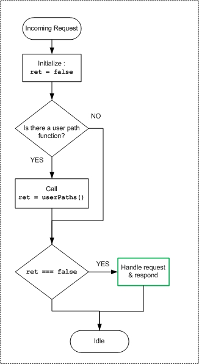

# Access Point HTTP Servers

This file describes how HTTP servers were implemented for the [jxmot/tessel-networking-example
](https://github.com/jxmot/tessel-networking-example) project. 

- [Overview](#overview)
  * [Features](#features)
  * [Use](#use)
- [Details](#details)
  * [Document Roots and Shared Resources](#document-roots-and-shared-resources)
    + [Resource Folder Hierarchy](#resource-folder-hierarchy)
  * [User Path Handler](#user-path-handler)

<small><i><a href='http://ecotrust-canada.github.io/markdown-toc/'>Table of contents generated with markdown-toc</a></i></small>

**Related Documents:**
* [Project README](https://github.com/jxmot/tessel-networking-example/blob/master/README.md)
* [Application Design Details](https://github.com/jxmot/tessel-networking-example/blob/master/appdesign.md)
* [Tessel 2 Firmware Modifications](https://github.com/jxmot/tessel-networking-example/blob/master/t2mods.md)

# Overview

This is a basic HTTP server, it is intended to be part of a larger project.

## Features

* Multiple instances, with :
    * Individual document root location
    * Optional custom path handlers
    * Shared common resource location
* Small footprint

## Use

Here is a simple example of how the server might be used :

```javascript
const httpsrv = require('./tessel-ap-http.js');
var http = new httpsrv('192.168.1.101', 80, 'www');
```

# Details

The operation of the server is :

<p align="center">
  
</p>

## Document Roots and Shared Resources

Each *instance* of the HTTP server shares a common resource path in addition to the instance specific resource path. The server will automatically seek the requested resource in both paths. If the resource is not found the server will respond with a `404` page.

<p align="center">
  
</p>

### Resource Folder Hierarchy

Here is how the HTTP folders are arranged for the [jxmot/tessel-networking-example
](https://github.com/jxmot/tessel-networking-example) project:

```
\ ------+ *.js - Project files
        |
        |
        +- public --+-- 404.html
                    |
                    +-- assets ---+
                    |             |
                    |             + css -- 404.css
                    |
                    |
                    +-- www ------+-- index.html, favicon.ico
                    |             |
                    |             +-- assets -+
                    |                         + img -- tessel.png 
                    |
                    |
                    +-- wwwadmin -+-- index.html, favicon.ico
                                  |
                                  +-- assets -+
                                              + css -- index.css 
                                              |
                                              + img -- tessel.png 
```

## User Path Handler

Each instantiation can optionally have a *user path hander* associated with it. This allows for customization of the files served and API endpoints by the user of the module.

<hr>
<p align="center">© 2018 J.Motyl</p>
