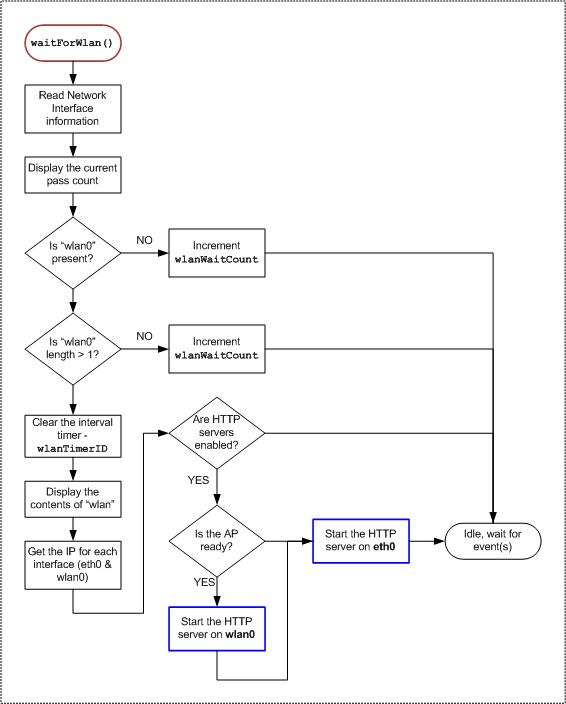

# Application Design Details

This document will cover the design details of the [jxmot/tessel-networking-example](https://github.com/jxmot/tessel-networking-example) project.

- [Application Initialize and Start Up](#application-initialize-and-start-up)
  * [Access Point Initialization](#access-point-initialization)
    + [Wireless Network Interface Initialization](#wireless-network-interface-initialization)
  * [HTTP Server Initialization](#http-server-initialization)
    + [User Path Handler](#user-path-handler)
  * [Shutdown and Disable](#shutdown-and-disable)
- [Tessel 2 Network API Modifications](#tessel-2-network-api-modifications)

<small><i><a href='http://ecotrust-canada.github.io/markdown-toc/'>Table of contents generated with markdown-toc</a></i></small>

**Related Documents:**
* [Project README](https://github.com/jxmot/tessel-networking-example/blob/master/README.md)
* [Tessel 2 Firmware Modifications](https://github.com/jxmot/tessel-networking-example/blob/master/t2mods.md)
* [Web Server Design Details](https://github.com/jxmot/tessel-networking-example/blob/master/aphttp.md)

# Application Initialize and Start Up

The `t2 init` command creates an `index.js` file with the following - 

```javascript
'use strict';

// Import the interface to Tessel hardware
const tessel = require('tessel');

// Turn one of the LEDs on to start.
tessel.led[2].on();

// Blink!
setInterval(() => {
  tessel.led[2].toggle();
  tessel.led[3].toggle();
}, 100);
```

A variation of that code is used in this application for the purpose of indicating that it is running. Additions to it have included - 

* Turning off the GPIO ports, which has the side effect of turning off the PORT A and PORT B LEDs.
* Increasing the blink interval to 500ms.
* Saving the timer id for a subsequent call to `clearInterval()`.

In addition, `index.js` has been renamed to `tessel-ap-test.js`.

The remainder of the code in `tessel-ap-test.js` consistutes the remaining *logic* code for this application. Here is an overview of its operation :

<p align="center">
  
</p>

## Access Point Initialization

This application initializes the access point programmatically. Here is an overview of how it's been accomplished :  

<p align="center">
  
</p>

### Wireless Network Interface Initialization

After the access point has been created and enabled, a periodic call to `os.networkInterfaces()` is made and its returned data is checked for the presence of an array labeled as `"wlan0"`. When it is present and containing two elements it is evidence that the access point is running and available.

<p align="center">
  
</p>

## HTTP Server Initialization

The HTTP server has been implemented as a *class*. This makes it possible to instantiate *more than one* server. After a server has been initialized and is listening it can serve resources from one of two locations :

* From the path to the `docroot`, where `docroot` was one of the arguments used when instantiating this class
* From a *common* path. This path is shared by all instantiated servers. Its purpose is to server up 404 pages and other common file resources.

<p align="center">
  
</p>

### User Path Handler

The `userPaths` argument to the `httpsrv` class is optional and can be used for providing a function to the server that handles application specific paths and/or endpoints. If it detects and responds to a request the function must return `true`. A return of `false` will indicate to `httpsrv` that the request was not handled and that it should satisfy the request.

<p align="center">
  
</p>

## Shutdown and Disable

When a *signal*(such as CTRL-C) is received by the application it will halt all interval timers and disable the access point. If this is not done the access point **will** continue to operate and accept connections even if the application is no longer running.

<p align="center">
  
</p>

# Tessel 2 Network API Modifications

The following functionality has been added to the Tessel 2 firmware - 

* Get/Set the WiFi channel
* Request a list of stations currently connected to the access point

The required modifications are detailed in [jxmot/tessel-networking-example/t2mods.md](https://github.com/jxmot/tessel-networking-example/blob/master/t2mods.md).


<hr>

